<p align="center">
  
</p>

<p align="center">
  <a href="README.md">English</a> | <a href="README.zh-TW.md">繁體中文</a> | 日本語 | <a href="README.ko.md">한국어</a>
</p>

<p align="center">
  <strong>Next-Generation Mythic C2 Interface</strong><br>
  上級レッドチーム Operator のために設計された、Cyberpunk 調・リアルタイム・協調型の Command &amp; Control インターフェース
</p>

<p align="center">
  
  
  
  
  
  
  
  
</p>

<p align="center">
  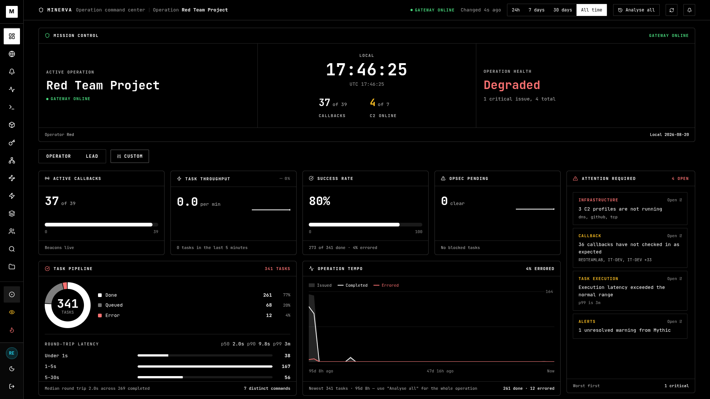
</p>

---

## 目次

- [概要](#概要)
- [Screenshots](#screenshots)
  - [★ 3D Cyber-Topology](#topology3d)
- [機能一覧](#機能一覧)
- [Application Map](#application-map)
- [Tech Stack](#tech-stack)
- [Quick Start（Production）](#quick-startproduction)
- [Development Mode（Hot Reload）](#development-modehot-reload)
- [デスクトップアプリ（Windows / macOS）](#デスクトップアプリwindows--macos)
- [Metasploit Integration](#metasploit-integration)
- [Setup Script（`minerva_install.sh`）](#setup-scriptminerva_installsh)
- [Mythic ソース修正（`mythic_change.sh`）](#mythic-ソース修正mythic_changesh)
- [Project Structure](#project-structure)
- [Architecture](#architecture)
- [Routing &amp; Sidebar](#routing--sidebar)
- [Nginx Proxy Layout](#nginx-proxy-layout)
- [Theme System](#theme-system)
- [Battle Mode](#battle-mode)
- [Audio System](#audio-system)
- [Custom Graph Nodes](#custom-graph-nodes)
- [Authentication &amp; Sessions](#authentication--sessions)
- [Environment Variables](#environment-variables)
- [Troubleshooting](#troubleshooting)
- [License](#license)

---

## 概要

<p align="center">
  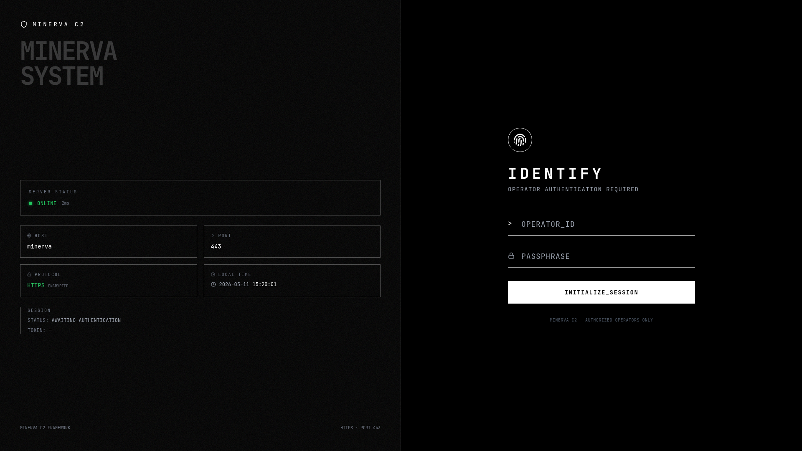
</p>

**Minerva** は [Mythic C2 Framework](https://github.com/its-a-feature/Mythic) 向けのモダンな Cyberpunk 調 Web インターフェースである。Mythic と**並存する独立スタック**として動作する —— Mythic 内蔵の `MythicReactUI` を置き換えるものではなく、その隣に立つもう一つのフロントエンドという位置づけだ。長期のレッドチーム作戦を回し、情報密度が高く操作の摩擦が少ないコンソールを必要とする Operator のために、ゼロから設計されている。

標準 UI に対して Minerva が加えるもの：

- **3D Cyber-Topology** —— 旗艦ビュー。作戦全体を Three.js の生きた地図として描く。サブネットは半透明のボリューム、C2 と P2P のリンクは色で描き分けられ、ノードごとの **QUICKHACK** と **DOSSIER** パネルはシーンを離れずにその場で開く。詳細は[後述のツアー](#topology3d)を参照。
- **リアルタイム協調グラフ** —— ReactFlow による Callback トポロジー。Relay／Proxy インフラを表す共有 Custom Node を持ち、Hasura 経由で全ログイン中 Operator に 5 秒ごとに同期される。
- **高機能な Interactive Console** —— 構造化された出力ブロック、Mimikatz パース、プロセス一覧の描画、File Browser オーバーレイ、ドラッグ&ドロップアップロード、インライン Tasking フォームを備えたマルチタブ端末。
- **Quick Hack ワークフロー** —— Callback に対してワンクリックで実行できる定型レッドチームワークフロー（recon／persistence／dumping／lateral movement）を、Tasking マクロとして連鎖させる。
- **ネイティブ Metasploit 統合** —— Launch Dashboard、Session ライフサイクル管理、永続的な実行履歴、リアルタイムの Task Browser 出力パースを備えた MSF-RPC クライアント。
- **MITRE ATT&amp;CK マトリクス** —— Task／Command／Tag のオーバーレイを重ねた完全な T-id マトリクスで、Technique のカバレッジをその場で確認できる。
- **Eventing ワークフロー** —— Keyword Trigger と条件分岐ステップを備えた Mythic eventing インスタンスのビジュアルビルダー。
- **Battle Mode** —— 戦術 UI モード（Combat／Recon／Normal）。密度、アニメーション速度、環境音を作戦の状況に応じて再調整する。
- **テーマとオーディオ** —— CSS 変数駆動のダーク／ライトテーマ、カスタム背景画像、JetBrains Mono／Inter のタイポグラフィ、IndexedDB 管理の音楽ライブラリ、イベント別 SFX。

### デプロイの形

Minerva は **Mythic とは完全に分離した独自の Docker スタック**として動作する —— Mythic の `MythicReactUI` ディレクトリにコピーされることも、`mythic_react` コンテナに焼き込まれることもない。`scripts/minerva_install.sh`（あるいは `docker compose up -d`）が 2 つのコンテナを起動する：`minerva-dev`（Mythic が自身の UI を提供するのと同じく `react-app-rewired` が React アプリを配信）と、その前段に立つ `minerva` Nginx コンテナである。後者は **443** で TLS を終端し、`/graphql`、`/auth`、`/refresh`、`/msf-rpc`、`/direct` を `host.docker.internal` 越しに既存の Mythic インスタンスへリバースプロキシする。初回起動時に自己署名証明書を生成し、Mythic 自身の UI には一切手を触れない。

`minerva_install.sh` は、素の Mythic に必要な一度きりのバックエンド準備も行う：`.env` の設定、必要な Go パッチの適用（`mythic_change.sh`）、Hasura のセットアップである。これらが触れるのは Mythic の**バックエンドのみ**で、Minerva 自体は常に自分のコンテナの中に留まる。

> **コンテナ間到達性（`.env`）：** `minerva` コンテナは Mythic の docker network 上にいないため、ホストゲートウェイ（`host.docker.internal`）経由で Mythic に到達する。これが機能するには、Mythic がポートを loopback だけでなく全インターフェースで公開している必要がある —— したがって Mythic の `.env` の `NGINX_BIND_LOCALHOST_ONLY`（ポート 7443）と `MYTHIC_SERVER_DYNAMIC_PORTS_BIND_LOCALHOST_ONLY`（C2 ポート 7000-7010）は**必ず `"false"`** でなければならない。`minerva_install.sh` はこれを自動かつ冪等に設定する。手動インストールの場合は自分で設定し、`./mythic-cli start` で再バインドすること。`"true"` のままにしておくことが、新規インストールが connection refused で失敗する最も一般的な原因である。

---

## Screenshots

### 1 · Authentication

#### Login

Cyberpunk 調の認証画面。リアルタイムのサーバー状態監視、HTTPS 暗号化インジケータ、Session State トラッカーを備える。

<p align="center">
  
</p>

### 2 · Command &amp; Control

#### Dashboard

作戦全体の概観 —— Active Callbacks、Total Payloads、C2 インフラの状態、T- / T-0 / T+ の作戦タイムラインを備えた Operation 詳細、Command 統計、資産収集メトリクス、Top Commands、直近のアクティビティフィード。パネルレイアウトは階層に制限のない分割ツリーで、どのパネルも水平・垂直に分割でき、その配置は Operator ごとに保存される。

<p align="center">
  
</p>

<a id="topology3d"></a>

#### 3D Cyber-Topology &nbsp;·&nbsp; ★ 旗艦機能

> **Minerva はこのビューを中心に組み上げられている。** Dashboard が数字で数えるものを、Topology はあるべき位置にそのまま描く —— どのホストを掌握しているか、トラフィックが実際にどう経由しているか、そして次のホップとの間に何が立ちはだかっているか。

自由な Orbit 操作が可能な完全な Three.js シーン。マシンは物理レイアウトで配置され、**Network Space** ごとにグループ化される —— CIDR ごとに 1 つの半透明ボリュームがあり、サブネットとノード数がラベル表示される。リンクの種別は推測ではなく色が担う：直結の **C2** はシアン、**P2P** リレー鎖はマゼンタで、各エッジにはトランスポート（`http`、`tcp`）が付記される。Tunnel レイヤーは進行中の SOCKS／RPORTFWD 鎖を同じグラフの上に重ねる。

ノードの色は状態そのものである：**CORE**（Minerva サーバー自身）、**ALIVE**、**HIGH PRIV**、**DEAD**、そして Operator が定義した **CUSTOM** リレーノード。下部のステータスバーはマシン数、Callback 数、生存／死亡 Session 数、Custom Node 数、エッジ数、ネットワーク数をリアルタイムに数え続ける。Network Space は CIDR 単位で非表示にでき、いま作業中のセグメントだけにシーンを絞り込める。非表示リストはリロードをまたいで保持され、シーンメニューの **HIDDEN SPACES** グループから復元できる。

<p align="center">
  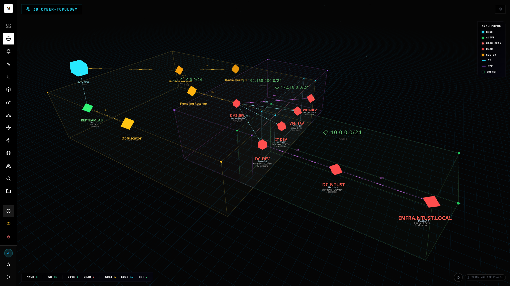
</p>

ノードを右クリックするとアクションメニューが開く —— 各行は枠付きのコントロールで、状態は右側のチップが担い（`LOCKED`、`ON`、`ARMED`）、破壊的な行は発火前に一度 arm 状態を経る。そのうち 2 つの行は**シーンを離れないまま**ビューポートを引き受ける。下のスクリーンショットが捉えているのがそれである：

- **QUICKHACK** —— 攻撃パネルがノードの脇にドッキングする（`HARVEST`、`RPFWD`、`SOCKS`、`DISCONNECT`、`AMPLIFICATION`）。対象の Agent が実行できない hack はグレーアウトして `N/A` チップが付き、残りは発火に必要なパラメータ数（`1 VAR`、`3 VARS`）を表示する。フッターは arm 中のターゲットを追跡する。
- **VIEW DETAILS** —— ノードのドシエ。左側にはそのマシンの記録 —— identity、platform、network、link が `//SECTION` ヘッダーごとにまとめられる。右側は **DEFENCE MATRIX** で、当該ホスト上の全 Session に加え、「この箱に手を出して安全か」を決める 3 つの状態を並べる：**アンチウイルス／EDR**、**ファイアウォール**、**権限**。AV とファイアウォールは Operator が付けるマークであり（Mythic はどちらも報告しない）、Operator の Preferences を通じてホストごとに保持される。権限は Session からリアルタイムに導出され、プラットフォームごとに表示が変わる —— Linux／macOS では `ROOT`、Windows では `SYSTEM`／`ADMIN`。

どちらのパネルもモーダルではなくドッキング型である：背後で Topology は更新され続け、`ESC` または **EXIT INTERFACE** を押すまで閉じない。

<p align="center">
  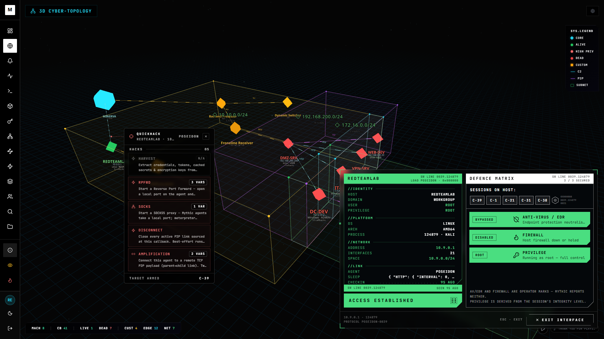
</p>

#### Event Feed

アラートカウンタ付きのリアルタイムイベントストリーム。サイドバーの通知ベルと連動し、新規 Callback、Alert、Custom Event、Feedback、Startup イベントを発生と同時に表示する。

<p align="center">
  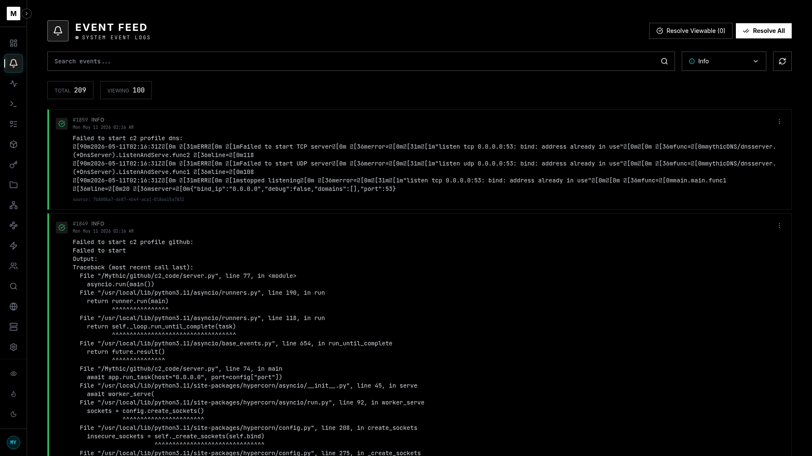
</p>

#### Operations Manager

Operation のライフサイクル管理。状態追跡（Active／Complete／Deleted）、Operator の割り当て、Operation ごとの OPSEC Command Blocklist を備える。

<p align="center">
  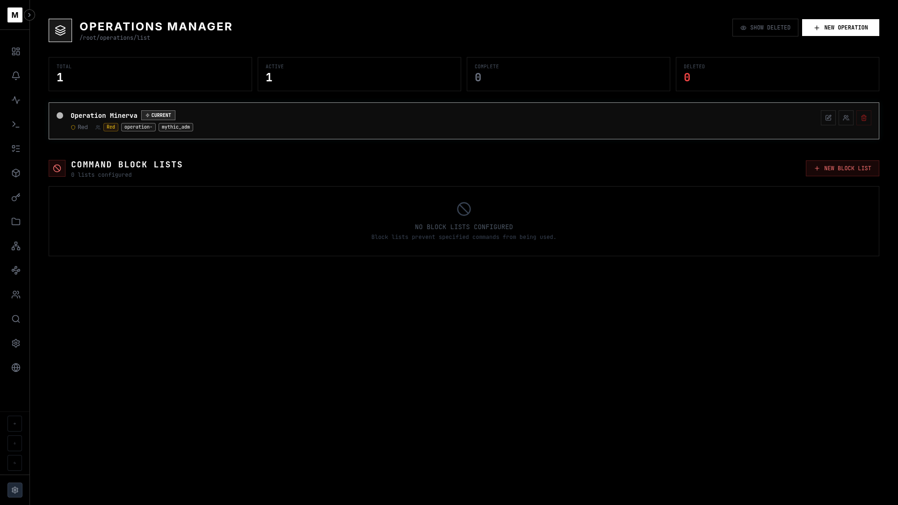
</p>

#### OPSEC

Operation 単位の OPSEC 制御 —— Command Blocklist、ロールベースのゲート、Tasking 実行時の強制。

<p align="center">
  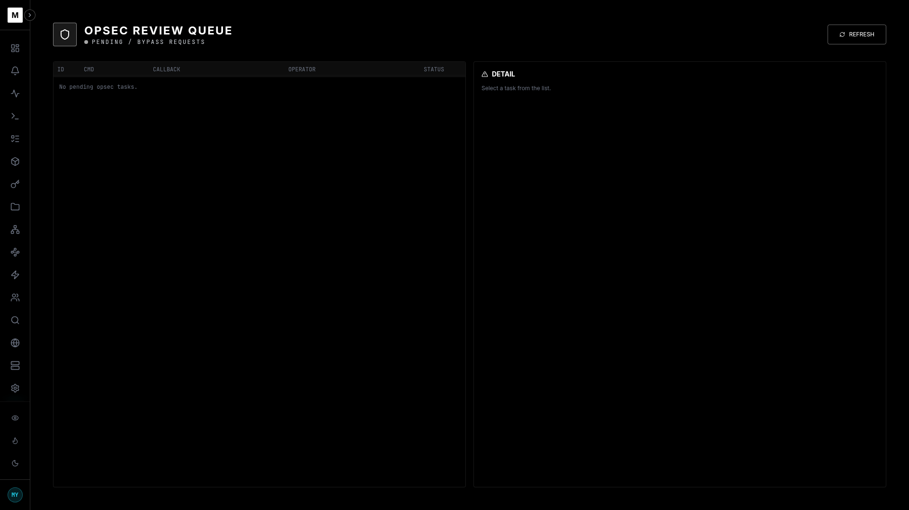
</p>

### 3 · Callbacks &amp; Tasking

#### Active Callbacks

Minerva の Core ノードとアクティブな Agent の接続関係を示す ReactFlow グラフビュー。共有 Custom Node が Relay／Proxy インフラを表現する。下部のソート可能なデータテーブルは一括操作、Sleep／Jitter 編集、グループ化、Last-Checkin バッジに対応する。

<p align="center">
  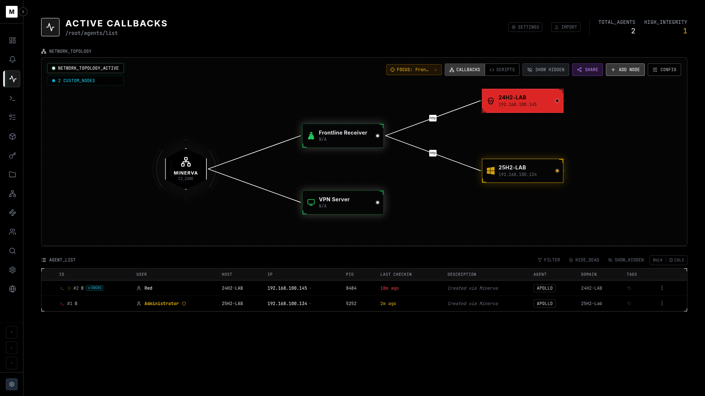
</p>

#### Console Selection

マルチ Callback Interactive Console のタブピッカー。過去に開いた全タブを表示し、コンテキストを失わずに Callback 間を行き来できる。

<p align="center">
  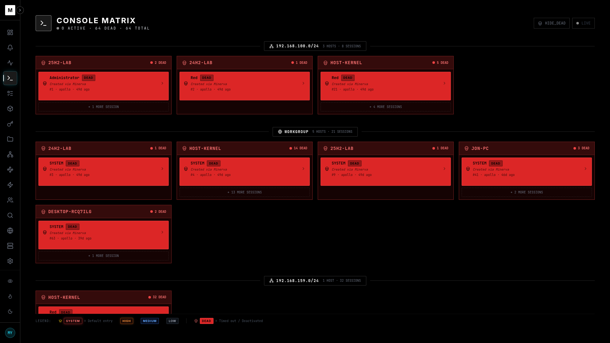
</p>

#### Interactive Console

構造化された出力ブロックを備えたコマンド Tasking —— Mimikatz パース、プロセス一覧、File Browser オーバーレイ、インライン Tasking フォーム、ドラッグ&ドロップアップロード、リアルタイムストリーミングの Task ブロック。

<p align="center">
  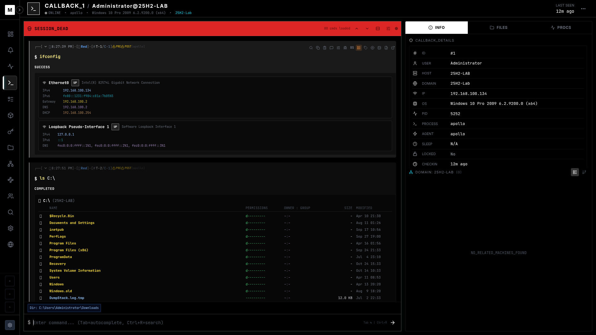
</p>

#### Tasks

単一 Task の詳細ビュー。完全な Host Tree、パラメータインスペクタ、構造化出力ビューア、前後 Task へのナビゲーションを備える。

<p align="center">
  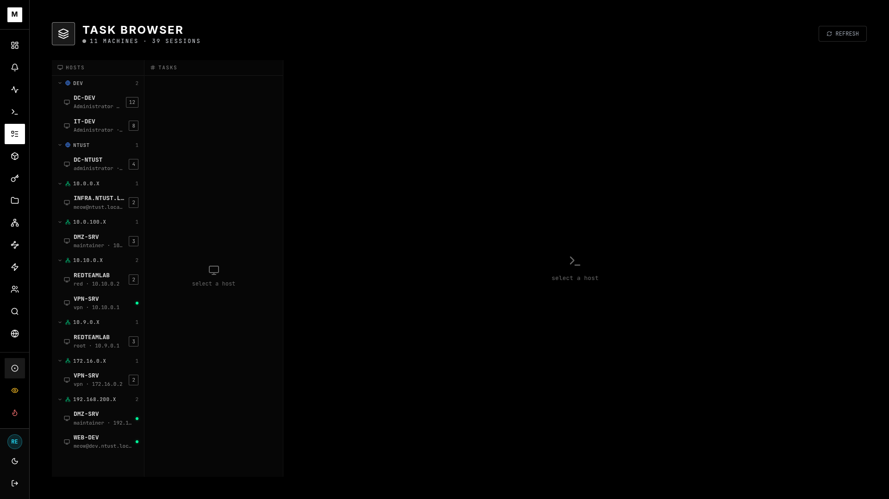
</p>

### 4 · Payloads

#### Payloads Overview

Payload 一覧、多段階 Create-Payload ウィザード、Wrapper フローの集約点。Payload 設定のインポート／エクスポートと、既存 Payload からの再ビルドに対応する。

<p align="center">
  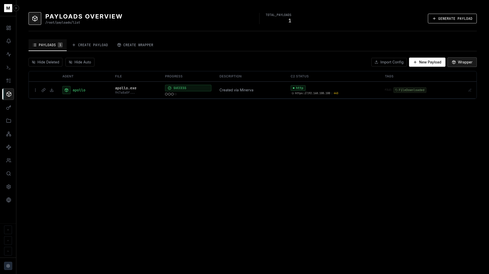
</p>

#### Create Payload Wizard

段階的なビルドパイプライン：OS &rarr; type &rarr; commands &rarr; C2 &rarr; build。各ステップが状態を保持するため、進捗を失わずに前のステップへ戻って調整できる。

<p align="center">
  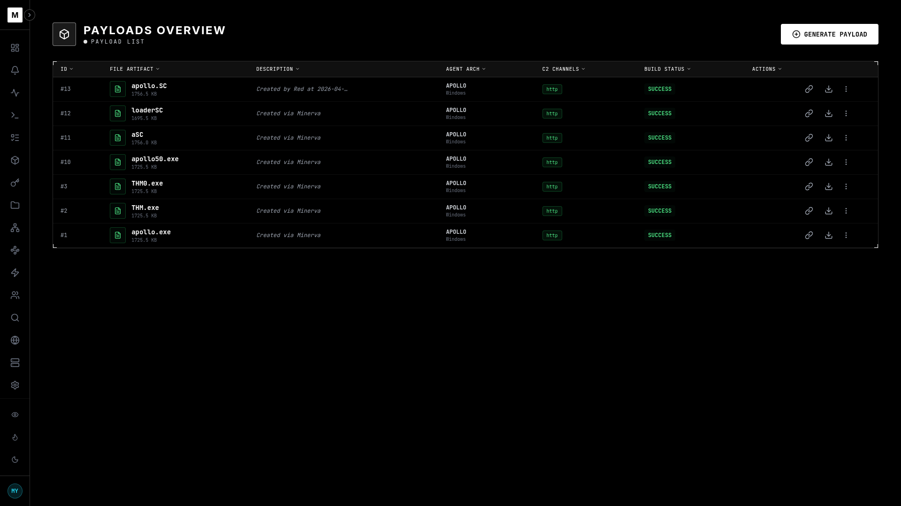
</p>

#### Payload Types

インストール済みの Agent／Wrapper／Translator／Consuming Service／Custom Browser を一望するビュー。ヘッダーツールバーは**検索**、**ソート（名前／状態／コマンド数）**、**オンラインのみ**フィルタ、**削除済みを表示**トグルを備える。各カードは Agent の SVG アイコン、コンテナ状態、Build Parameter インスペクタ、Command Browser、コンテナファイルエディタ、Webhook／Logger イベントのワンクリックテストを含む。

<p align="center">
  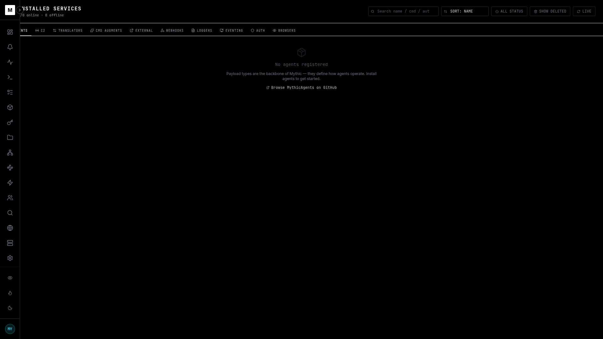
</p>

### 5 · Infrastructure

#### C2 Profiles

C2 通信プロファイルの管理。インストール済みの全プロファイル（discord、dns、github、http、https、tcp、websocket）をバージョン情報、状態インジケータ、コンテナファイルの一覧／編集、起動停止コントロールとともに表示する。

<p align="center">
  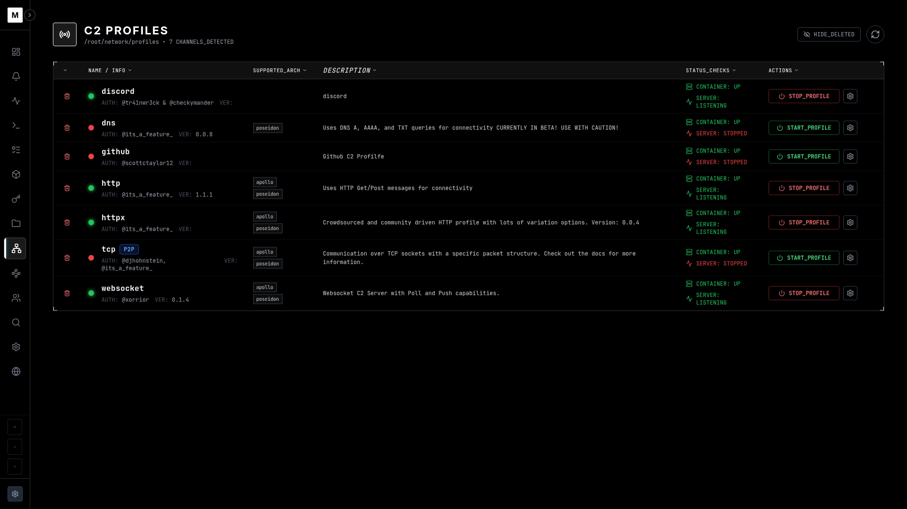
</p>

#### Tunnel Manager

Tunnel の管理。Operator 側 Proxy、C2 サーバーのリレー、ターゲット側エンドポイントを示すビジュアルフロー図を備え、稼働中の Tunnel 状態、ポートマッピング、接続鎖の全体を表示する。

<p align="center">
  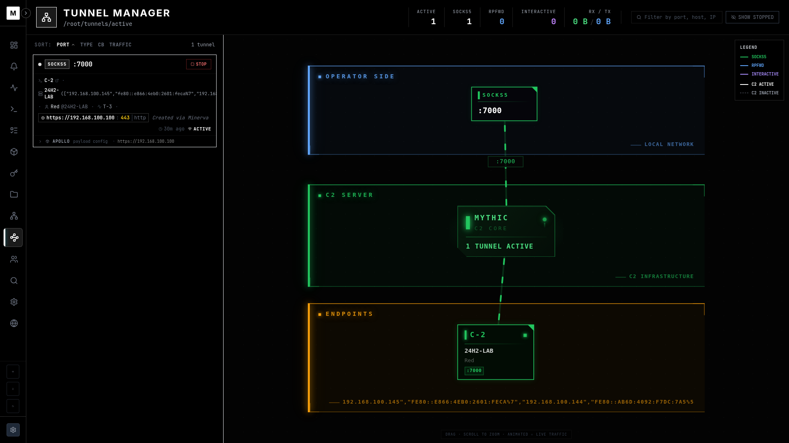
</p>

### 6 · Files, Credentials &amp; Intel

#### File Manager

集中型のファイル管理。Downloads、Uploads、Screenshots、Eventing ワークフローファイルにカテゴリ分けされたサイドバーを備え、ターゲットマシンの File Browser ツリーも含む。

<p align="center">
  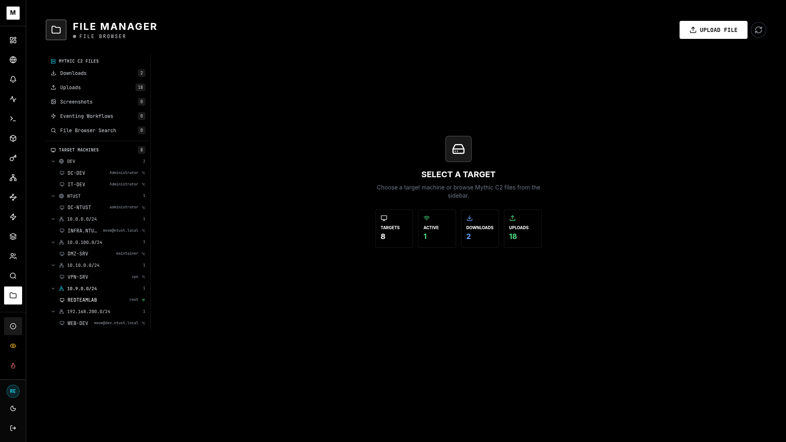
</p>

#### Credentials Vault

認証情報のストレージ。複数フィールド検索（Account、Realm、Credential、Comment、Tag）に対応し、検証済みと収集済みの件数を追跡して、各認証情報を取得元の Task へ紐づける。

<p align="center">
  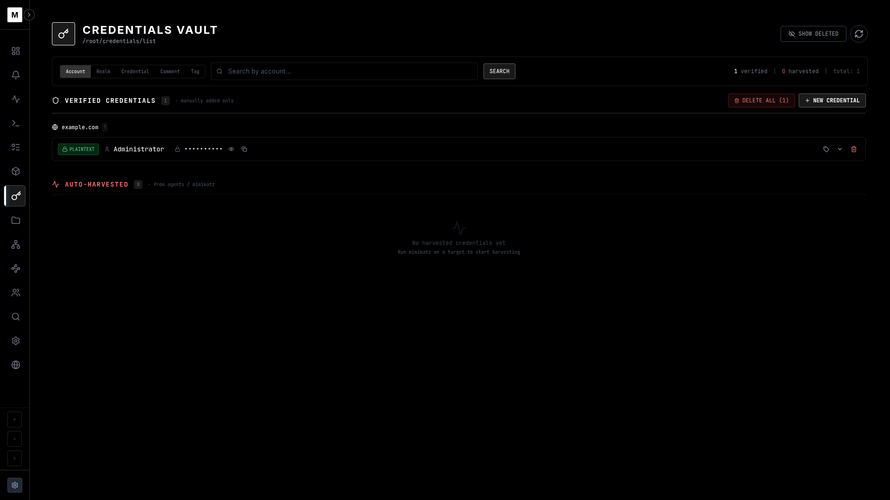
</p>

#### Artifacts

IoC／Artifact ビューア。Task へのリンクとホストの帰属情報を持つ。

<p align="center">
  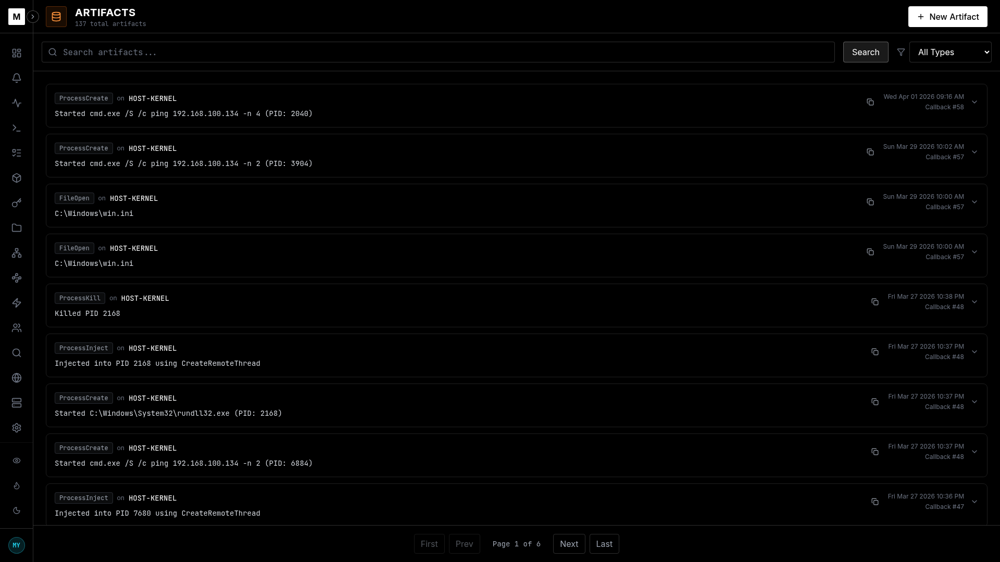
</p>

#### Search

Task、File、Credential、Callback、Artifact を横断するグローバル検索。高度なフィルタリングに対応し、すべてのクエリは現在の Operation にスコープされる。

<p align="center">
  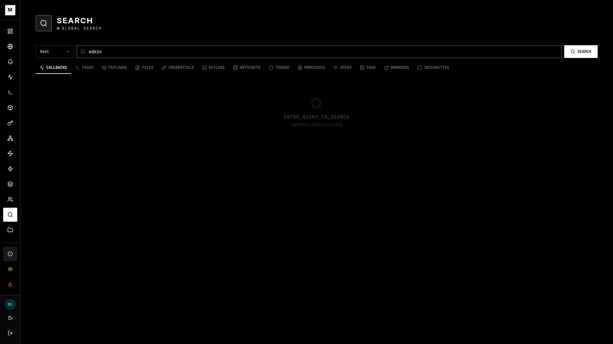
</p>

### 7 · Automation &amp; Frameworks

#### Quick Hacks

ワンクリックのレッドチームワークフローライブラリ（recon／persistence／dumping／lateral）。選択した Callback 群に対してコマンドを連鎖実行する。ワークフローは JSON 定義で Operator が拡張でき、Topology のノード別 **QUICKHACK** パネルも同じライブラリで動いている。

<p align="center">
  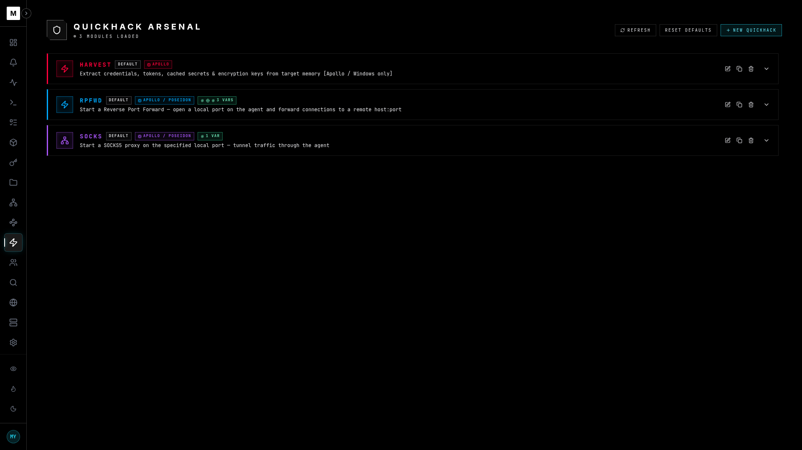
</p>

#### Metasploit

ネイティブ MSF-RPC クライアント。タブは **Dashboard**（Session／Job／Module）、**Launch Attack**（Module Browser + パラメータフォーム）、**Operations**（稼働中の Session、Job、Route）、**Task History**（完全な出力を伴う永続的な実行履歴）で構成される。

<p align="center">
  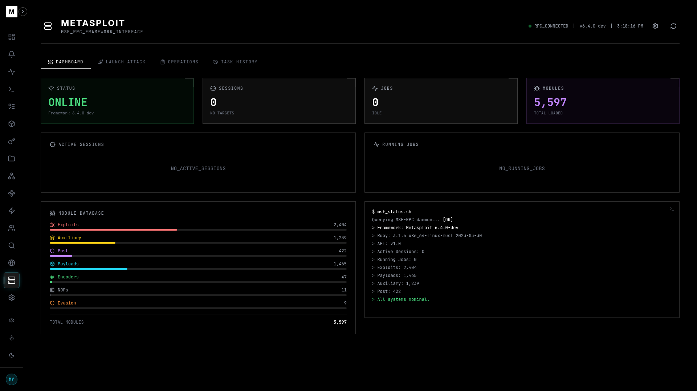
</p>

#### Eventing

Mythic eventing のビジュアルワークフロービルダー —— Event Group、Instance、Keyword Trigger、条件分岐ステップ、そして条件に一致したイベントのリアルタイムストリーム。

<p align="center">
  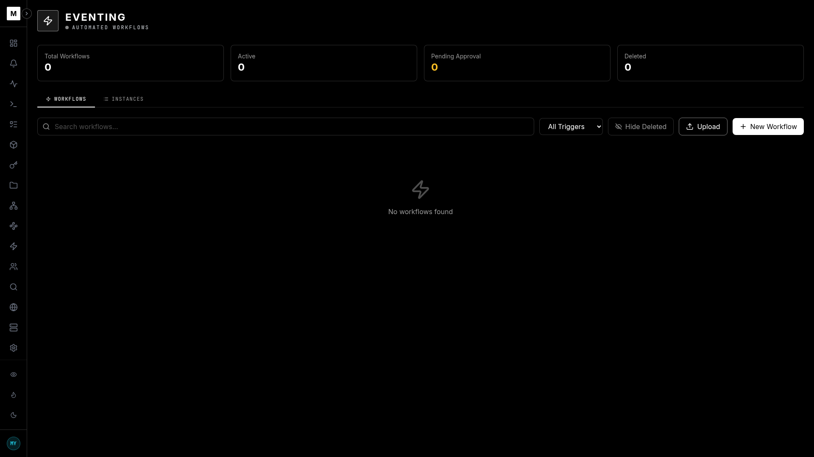
</p>

### 8 · Intel &amp; MITRE

#### MITRE ATT&amp;CK

全戦術カテゴリにわたる 637 の Technique をマッピングした完全な MITRE ATT&amp;CK マトリクス可視化。Tasks、Tasks/PT、Commands、Tags でフィルタでき、セルが点灯して実行カバレッジを示す。

<p align="center">
  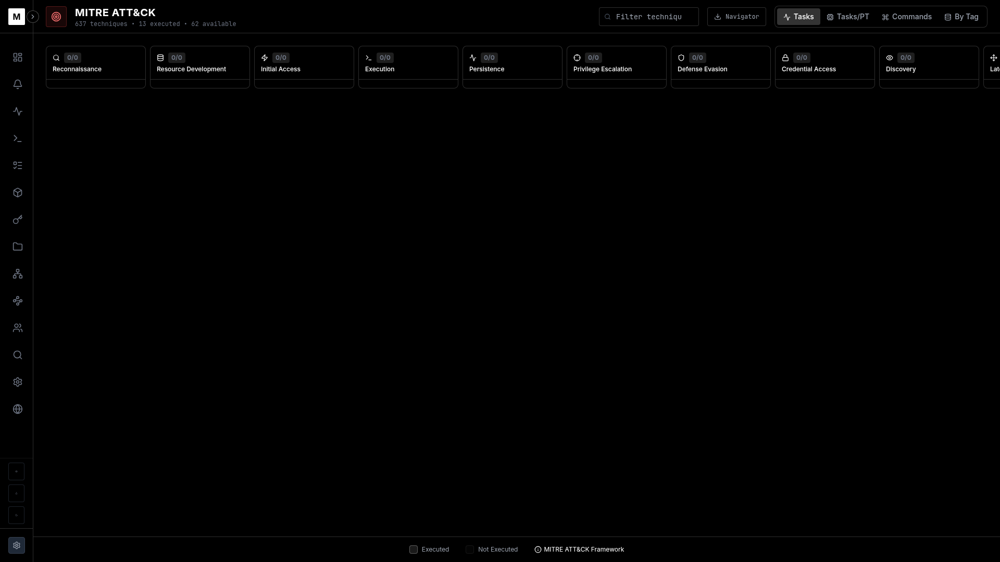
</p>

### 9 · Admin &amp; Customization

#### Users

Operator の管理：作成、編集、無効化、パスワード変更、Admin ロールの切り替え。

<p align="center">
  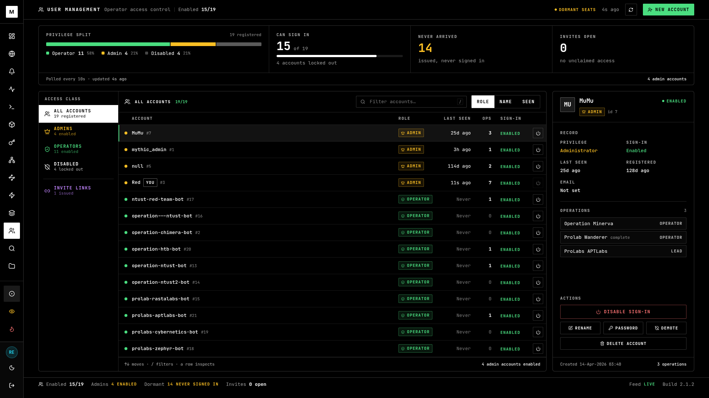
</p>

#### Reporting

Operation データを基にしたレポートビルダー。分析、フィルタ、エクスポートのオプションを備える。

<p align="center">
  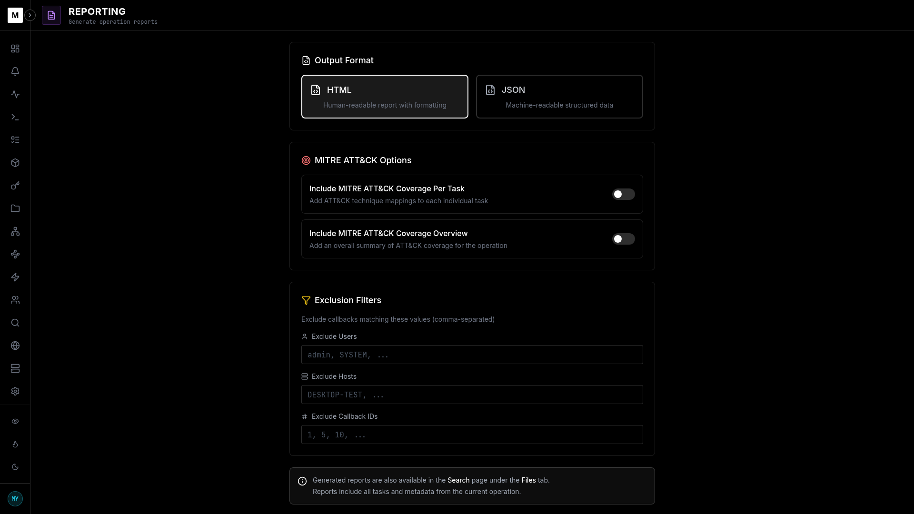
</p>

#### Browser Scripts

編集可能な Browser Script ライブラリ。仮想化テーブル、ソート可能な列、`tabs` レンダリング、Payload Type ごとのスコープに対応する。

<p align="center">
  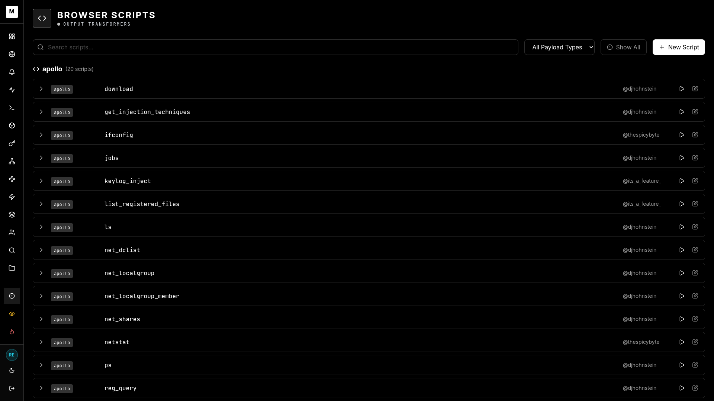
</p>

#### Tags

全エンティティを横断するタグベースの整理とフィルタリング。

<p align="center">
  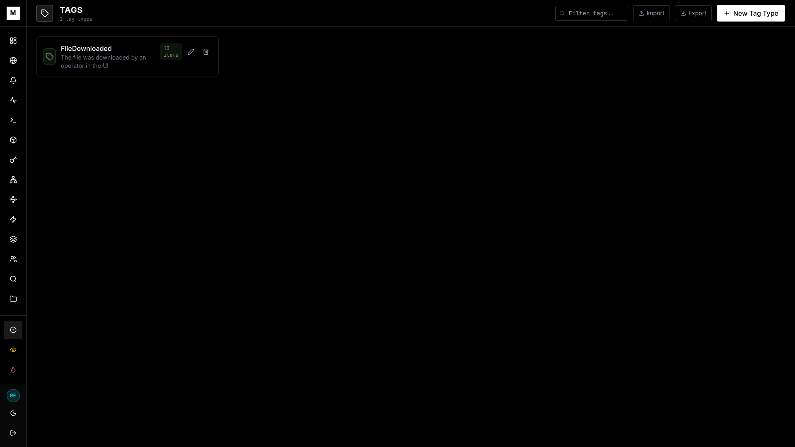
</p>

#### Settings

包括的な設定パネル。Operator Preferences、表示トグル、タイムスタンプ書式、Task 操作モード、Browser Script オプション、オーディオ／音楽ライブラリ、テーマパレット、サイドバーショートカットの並び順を扱う。

<p align="center">
  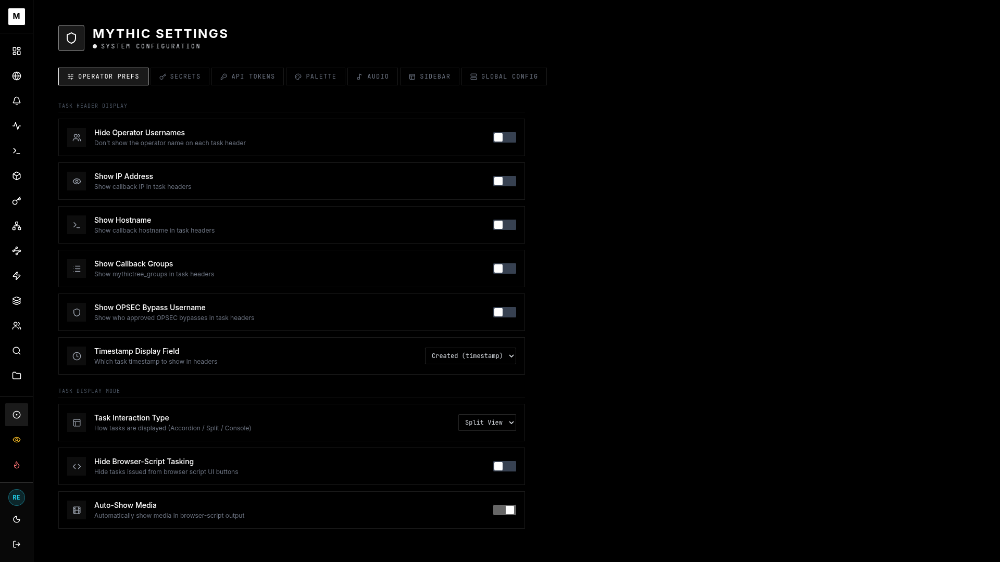
</p>

---

## 機能一覧

### Visualization

| 機能 | 説明 |
|------|------|
| **3D Topology** &nbsp;★ | Three.js による 3D ネットワークマップ —— Orbit 操作、CIDR Network Space の半透明ボリューム（非表示可・保持）、物理レイアウト、C2／P2P を色で分けたエッジ、Tunnel レイヤー、リアルタイムステータスバー、ノード右クリックメニュー、シーン内 **QUICKHACK** パネルと**ノードドシエ + DEFENCE MATRIX** |
| **Callback Graph** | ReactFlow によるインタラクティブ 2D グラフ。ELK 自動レイアウト、Custom Node の作成、エッジ管理、PNG エクスポート、Graph Config パネルを備える |
| **Custom Nodes** | Operator が定義する Relay／Proxy ノード。Hasura `agentstorage` にサーバー側保存され、接続中の全 Operator に 5 秒ごとに同期される |
| **MITRE ATT&amp;CK** | Technique マッピング、実行追跡、Task／Command／Tag オーバーレイを備えた完全な ATT&amp;CK マトリクス |
| **Tunnel Map** | 親子 Tunnel の関係、ポートマッピング、リアルタイム状態を示す Cyberpunk 調フロー図 |

### Core Operations

| 機能 | 説明 |
|------|------|
| **Dashboard** | T- / T-0 / T+ の作戦タイムラインと、Operator ごとに保持される階層無制限の分割ツリーレイアウトを備えた作戦概観 |
| **Callbacks** | リアルタイム Callback 追跡。健全性インジケータ（alive／dead／streaming）、一括操作、グループ化、Last-Checkin バッジ、Sleep／Jitter 編集に対応 |
| **Console** | マルチタブのインタラクティブ Tasking。シンタックスハイライト付き出力ブロック、分割ビューの DB 出力、コマンド履歴、autoScroll トグル、ドラッグ&ドロップアップロード、ストリーミング Task 結果 |
| **Tasks** | 単一 Task 専用ビュー。完全な Host Tree、パラメータインスペクタ、出力ビューア、Task 単位のナビゲーション |
| **Payloads** | 多段階 Create-Payload ウィザード（OS &rarr; type &rarr; commands &rarr; C2 &rarr; build）、Wrapper フロー、Payload のインポート／エクスポート、既存からの再ビルド、Browser Script の `tabs` 出力に対するタブ上限 |
| **Files** | ダウンロード／アップロードの追跡、サムネイル一覧付きスクリーンショットビューア、Keylog 検索、モーダルからのドラッグ&ドロップアップロード、Artifact の整理 |
| **Credentials** | 重複排除、ハッシュ管理、アカウント紐づけ、複数フィールド検索を備えた Vault |
| **Search** | Task、File、Credential、Callback、Artifact を横断するグローバル検索 —— 現在の Operation にスコープされる |
| **Artifacts** | Task へのリンクを持つ IoC／Artifact ビューア |
| **Tags** | 全エンティティを横断するタグベースの整理とフィルタリング |

### Advanced

| 機能 | 説明 |
|------|------|
| **Battle Mode** | Combat／Recon／Normal の切り替えと戦術 UI 最適化（Combat ではアニメーション 2 倍速、Recon では非重要情報を減光） |
| **Eventing** | Mythic eventing のビジュアルワークフロービルダー —— Event Group、Instance、Keyword Trigger、条件分岐ステップ、一致イベントのリアルタイムストリーム |
| **Quick Hack** | ワンクリックのレッドチームワークフローライブラリ（recon／persistence／dumping／lateral）。選択した Callback にコマンドを連鎖実行し、Topology のノード別攻撃パネルも駆動する |
| **Metasploit** | Launch Dashboard、Session 一覧、Job 制御、認証情報の保存、永続的な実行履歴を備えたネイティブ MSF-RPC クライアント |
| **Operations** | ロールベースアクセスと Operation ごとの OPSEC Command Blocklist を備えたライフサイクル管理 |
| **Reporting** | Operation データからのレポート生成と分析 |
| **C2 Profiles** | プロファイル設定、コンテナファイルの一覧／編集、起動停止制御 |
| **PayloadTypes** | インストール済みの全 Agent／Wrapper／Translator／Consuming Service／Custom Browser を、リアルタイム状態、Build Parameter インスペクタ、Command Browser、コンテナファイルエディタ、Webhook／Logger イベントのワンクリックテストとともに一望 |
| **Browser Scripts** | 仮想化テーブル、ソート可能な列、`tabs` レンダリング、PT ごとのスコープを備えた編集可能な Browser Script ライブラリ |
| **Audio System** | グローバル音楽プレイヤー（IndexedDB 管理のライブラリ）、イベント別サウンドエフェクト（Callback、Tunnel、認証、エラー）、SFX の個別トグル |
| **Theme &amp; Palette** | ダーク／ライトテーマ、カスタマイズ可能なアクセントカラー、カスタム背景画像、JetBrains Mono／Inter のタイポグラフィ |

---

## Application Map

UI 全体は `/new/...` 配下にマウントされる（標準の `mythic_react` と共存できるようにするため）。ルート一覧：

| パス | ページ | 用途 |
|------|--------|------|
| `/new/login` | `Login` | JWT 認証 + サーバー状態／SSL インジケータ |
| `/new/invite` | `Invite` | Operator 招待リンクによる登録 |
| `/new/dashboard` | `Dashboard` | 作戦概観とアクティビティフィード |
| `/new/topology` | `Topology3D` | **3D ネットワークマップ**（旗艦機能） |
| `/new/events` | `EventFeed` | アラートカウンタ付きリアルタイムイベントストリーム |
| `/new/callbacks` | `Callbacks` | Active Callback テーブル + グラフビュー |
| `/new/callbacks/:displayId` | `Callbacks` | 特定 Callback へのフォーカス（ディープリンク） |
| `/new/console` | `ConsoleSelection` | Console タブピッカー |
| `/new/console/:id` | `Console` | インタラクティブ Tasking 端末 |
| `/new/task` &middot; `/new/task/:displayId` | `SingleTaskView` | Task 単位の詳細ビュー |
| `/new/payloads` | `Payloads` | Payload 一覧 + タブ（list／create／wrapper） |
| `/new/create-payload/*` | `CreatePayload` | 多段階ビルドウィザード |
| `/new/create-wrapper` | （リダイレクト） | &rarr; `/payloads?tab=wrapper` |
| `/new/credentials` | `Credentials` | 認証情報 Vault |
| `/new/files` | `Files` | ファイル管理 + スクリーンショット |
| `/new/c2-profiles` | `C2Profiles` | C2 Profile 管理 |
| `/new/payload-types` | `PayloadTypes` | インストール済み全 Agent／Service |
| `/new/tunnels` | `Tunnels` | SOCKS／RPORTFWD トポロジー |
| `/new/quickhacks` | `QuickHacks` | ワンクリックワークフローライブラリ |
| `/new/metasploit` | `Metasploit` | MSF-RPC Dashboard／Attack／History |
| `/new/eventing` | `Eventing` | ワークフロー／Event Group ビルダー |
| `/new/mitre` | `MitreAttack` | ATT&amp;CK マトリクス |
| `/new/search` | `Search` | グローバル検索 |
| `/new/artifacts` | `Artifacts` | Artifact ビューア |
| `/new/reporting` | `Reporting` | レポートビルダー |
| `/new/operations` | `Operations` | Operation ライフサイクル + OPSEC Blocklist |
| `/new/users` | `Users` | Operator 管理 |
| `/new/browser-scripts` | `BrowserScripts` | カスタム Browser Script |
| `/new/tags` | `Tags` | タグ管理 |
| `/new/opsec` | `Opsec` | Operation の OPSEC 制御 |
| `/new/settings` | `Settings` | Operator の全設定 |

> サイドバーの項目は **Settings &rarr; Sidebar Shortcuts** から Operator ごとに並べ替え・非表示にできる。デフォルト一覧には `/new/jupyter` と `/new/graphql` という外部リンクも含まれる（それぞれ Mythic の Jupyter と Hasura コンソールを開く）。

---

## Tech Stack

| カテゴリ | 技術 |
|----------|------|
| **Frontend** | React 19、TypeScript 5.9+、React Router 7 |
| **Styling** | Tailwind CSS 3.4、Material-UI 7、Emotion、Framer Motion |
| **State** | Zustand 5（永続化 App Store）、Apollo Client 4（GraphQL + キャッシュ + Reactive Vars） |
| **Real-time** | `graphql-ws` による WebSocket 上の GraphQL Subscription |
| **3D** | Three.js 0.183、`@react-three/fiber`、`@react-three/drei` |
| **Graph** | `@xyflow/react` 12.6 + `elkjs` 0.11 の階層レイアウト |
| **Charts** | MUI X Charts、MUI X Data Grid |
| **Editor** | React Ace（コードエディタ／Eventing ワークフローのシンタックスハイライト） |
| **Data &amp; Storage** | IndexedDB（`musicDB`、Custom Graph Node キャッシュ）、ローカル SQLite 用 `sql.js`、共有状態用 Hasura `agentstorage` |
| **Animation** | Framer Motion（トランジション、モーダル）、CSS アニメーション（スキャンライン、グリッチ） |
| **Build** | React App Rewired 2.2、Webpack 5、PostCSS、`config-overrides.js` |
| **Deploy** | Docker、Nginx（SSL + リバースプロキシ + WS Upgrade） |
| **External** | HTTP 上の JSON-RPC による MSF-RPC（Metasploit Framework） |

---

## Quick Start（Production）

### 前提条件

- [Docker](https://docs.docker.com/get-docker/) と Docker Compose
- ホストから到達可能な [Mythic C2](https://github.com/its-a-feature/Mythic) インスタンス（デフォルト：`https://host.docker.internal:7443`）
- ホスト側でポート **443** が開いていること
- Minerva コンテナが `host.docker.internal` 経由で到達できるよう、Mythic の `.env` が loopback を超えてポートを公開していること：`NGINX_BIND_LOCALHOST_ONLY="false"` と `MYTHIC_SERVER_DYNAMIC_PORTS_BIND_LOCALHOST_ONLY="false"`。`scripts/minerva_install.sh` がこれを設定する。

### ワンコマンドインストール（`minerva_install.sh`）—— 推奨

同梱のセットアップスクリプトが、素の Mythic に導入する公式サポート経路である。Minerva 自身のスタックをデプロイし、Mythic の UI とコンテナには一切触れない：

```bash
# /opt/Minerva から実行
./scripts/minerva_install.sh          # フルインストール（手順は下記）
./scripts/minerva_install.sh up       # minerva + minerva-dev のみ再ビルド／起動
./scripts/minerva_install.sh down     # Minerva スタックを停止
./scripts/minerva_install.sh verify   # インストール検証（.env キー、コンテナ、HTTP 200）
./scripts/minerva_install.sh status   # Minerva + Mythic のコンテナ状態とログを表示
./scripts/minerva_install.sh fix      # .env を再適用してスタックを再ビルド／再起動
./scripts/minerva_install.sh clean    # DB から Custom Graph Node を削除
./scripts/minerva_install.sh uninstall  # Minerva スタックを停止・削除（Mythic は無傷）

# Metasploit:
./scripts/minerva_install.sh msf-start    # MSF-RPC コンテナを起動
./scripts/minerva_install.sh msf-stop     # MSF-RPC コンテナを停止
./scripts/minerva_install.sh msf-status   # 状態 + ログ
./scripts/minerva_install.sh msf-verify   # Python による接続確認
```

インストールの流れ：

1. コンテナ間到達性のために Mythic の `.env` を設定（冪等。上記 2 つの `*_BIND_LOCALHOST_ONLY` キー）。
2. `mythic_change.sh` を実行して Mythic の Go ソースにパッチを当て、`mythic_server` を再ビルド（後述）。
3. Mythic Agent 側パッチを適用（Apollo SOCKS/TCP、IPC バッファ）。
4. Custom Graph Node が Operator 間で同期できるよう Hasura `agentstorage` テーブルを設定。
5. `minerva` + `minerva-dev` コンテナをビルドして起動（nginx は **443**）。

Mythic に触れるのは手順 1〜4 だけで、いずれもバックエンド限定かつ冪等である。Minerva の UI が Mythic のファイルツリーやコンテナに入り込むことはない。Mythic が `/opt/Mythic` にない場合は `MYTHIC_DIR` 環境変数を設定すること。

### スタンドアロンコンテナ

```bash
git clone https://github.com/aifred0729-TW/Minerva.git
cd Minerva

# アプリ + Nginx イメージをビルドして起動（自己署名証明書は自動生成）
docker compose build
docker compose up -d
```

> 初回起動時は `minerva-dev` 内で React アプリをコンパイルする —— 1〜2 分ほど待つと `https://<host>/` が応答する。`minerva` Nginx コンテナは立ち上がり次第プロキシを始める。

**https://&lt;your-host&gt;/** を開くと `/new/login` にリダイレクトされる。Mythic の認証情報でログインすること。

リモートの Mythic インスタンスを指す場合：

```bash
MYTHIC_ADDRESS=https://10.0.0.5:7443 docker compose up -d
```

停止する場合：

```bash
docker compose down
```

> デフォルトの `docker-compose.yml` が公開するのは Minerva（ポート 443）のみである。`MYTHIC_ADDRESS` はテンプレート変数として Nginx に渡され、`/graphql`、`/auth`、`/refresh`、`/invite`、`/direct` の upstream に使われる。自動生成の自己署名証明書を置き換えるには、自前の `minerva.crt`／`minerva.key` を `nginx/ssl/` に置くこと。

---

## Development Mode（Hot Reload）

### アーキテクチャ

Dev モードは 2 つのコンテナを使う：

| コンテナ | 役割 | 説明 |
|----------|------|------|
| `minerva-dev` | React Dev Server | ポート 3000 で `react-app-rewired start` を HMR 付きで実行。ソースコードは volume マウントされ、変更するとブラウザが即座に更新される。 |
| `minerva`     | Nginx SSL Proxy  | 自己署名 SSL で **443** を待ち受ける。`/new/` &rarr; Dev Server、`/ws` &rarr; HMR WebSocket、`/graphql/`、`/auth`、`/refresh`、`/invite`、`/msf-rpc/`、`/direct/` &rarr; Mythic をプロキシする。 |

```
Browser :443 ── nginx (SSL) ── minerva-dev :3000   (React dev server + HMR)
                       ├──  Mythic :7443           (API / GraphQL / WebSocket)
                       └──  Metasploit :55553      (optional MSF-RPC)
```

### クイックスタート

```bash
docker compose -f docker-compose.dev.yml up -d --build
docker logs -f minerva-dev   # "webpack compiled" が出るまで待つ
```

**https://&lt;your-host&gt;/** を開く —— `src/` または `public/` 配下の変更は 1 秒未満で Hot Reload される。

### マウントされる Volume

| ホストパス | コンテナパス | 用途 |
|------------|--------------|------|
| `./src/` | `/app/src/` | React ソース（Hot Reload） |
| `./public/` | `/app/public/` | 静的アセット |
| `./tailwind.config.js` | `/app/tailwind.config.js` | Tailwind テーマ |
| `./postcss.config.js` | `/app/postcss.config.js` | PostCSS |
| `./config-overrides.js` | `/app/config-overrides.js` | Webpack オーバーライド |
| `./tsconfig.json` | `/app/tsconfig.json` | TypeScript 設定 |
| `./.env` | `/app/.env` | ビルド時環境変数 |

> `node_modules/` と `package.json` は**マウントされない** —— イメージ内に存在する。npm パッケージを追加・削除した後は `docker compose -f docker-compose.dev.yml up -d --build` で再ビルドすること。

### リモート Mythic への接続

```bash
MYTHIC_ADDRESS=https://10.0.0.5:7443 \
docker compose -f docker-compose.dev.yml up -d --build
```

### Dev と Production の切り替え

```bash
# Dev (HMR) → Production
docker compose -f docker-compose.dev.yml down
docker compose up -d --build

# Production → Dev
docker compose down
docker compose -f docker-compose.dev.yml up -d --build
```

---

## デスクトップアプリ（Windows / macOS）

<p align="center">
  
</p>

Minerva は **Windows** と **macOS** 向けのネイティブコンソールとしても配布される —— 同一の React バンドルを Electron で包んだもので、`src/` のフォークは存在しない。

デスクトップアプリに nginx はなく、コンソールはすべてのバックエンドを自身の origin 経由で参照する（`window.location.origin + "/graphql/"`、`wss://" + window.location.host + "/graphql/"`、`/direct/download/...`）。そこでプロキシ層をプロセス内へ移した：Electron のメインプロセスが `nginx.conf.template` をルート単位で写し取った loopback gateway を動かし、ウィンドウはそこからバンドルを読み込む。React 側からは違いが分からない。

**Operator はログイン画面が現れる前に、どの Mythic へ接続するかを指定する。** コンテナ配備ではそのアドレスは compose の設定だが、デスクトップ版では 1 つの実行ファイルが作戦から作戦へと持ち運ばれる。そのためアプリはまず接続ウィンドウを開き、到達性のプリフライトを走らせてから引き渡す：

```
起動 ──▶ 接続ウィンドウ ──▶ プリフライト ──▶ gateway ──▶ コンソール ──▶ Mythic ログイン
```

```bash
# 1. リポジトリのルートで一度バンドルをビルドする
npm install && npm run build

# 2. シェルをパッケージングする
cd desktop
npm install
npm run dist:win     # NSIS インストーラ + ポータブル版、x64 と arm64
npm run dist:mac     # dmg + zip、arm64 と x64（macOS ホストが必要）
```

インストーラは `desktop/dist/` に出力される。`.github/workflows/desktop-build.yml` は tag の push で両プラットフォームをビルドし、GitHub Release に添付する —— Mac を持たずに `.dmg` を得る方法はこれである。

コンテナ配備と意図的に異なる点が 2 つある：

- **外向き通信はデフォルトで閉じている。** Renderer は loopback gateway 以外に到達できず、これによりバンドルの Google Fonts リクエストも遮断される。C2 コンソールが作戦中に Operator のマシンから第三者へ通信すべきではない。
- **MSF-RPC はゲートを保持する。** `/msf-config` と `/msf-rpc/` は Mythic の `GET /me` へのサブリクエストで認可される。nginx が適用しているのと同じ `auth_request` 制御であり、有効な Operator トークンなしに Metasploit へ到達することはない。

詳細 —— アーキテクチャ、HMR を使った開発フロー、署名、設定ファイルの場所、セキュリティ方針 —— は [`desktop/README.md`](desktop/README.md) を参照。

---

## Metasploit Integration

<p align="center">
  
</p>

Minerva には MSF-RPC デーモンコンテナに支えられた第一級の Metasploit ページが含まれる。

### Stack

```
React (Metasploit page)
   └── /msf-rpc/  (nginx, proxy_pass)
         └── minerva_msf :55553  (msfrpcd --user msf --pass <generated> -S  (bound to 127.0.0.1))
```

### MSF-RPC の起動

```bash
# 方法 A: minerva_install.sh のラッパー経由
./scripts/minerva_install.sh msf-start
./scripts/minerva_install.sh msf-verify   # msfrpc_verify.py による Python 接続確認

# 方法 B: compose を直接使う
docker compose -f docker-compose.metasploit.yml up -d
```

認証情報／ポートの上書き：

```bash
MSFRPC_USER=msf MSFRPC_PASS=changeme MSFRPC_PORT=55553 \
docker compose -f docker-compose.metasploit.yml up -d
```

> `MSFRPC_PASS` にデフォルト値はない。`minerva_install.sh msf-start` が生成して `.env.msf` に書き込む。このファイルは git 管理外であり、認証情報がコミットされることはない。

### ページのタブ

| タブ | 用途 |
|------|------|
| **Dashboard** | 接続状態、ホスト統計、Session 数、直近の Job |
| **Attack** | Module Browser、パラメータフォーム、Target／Payload を指定した実行、認証情報の保存、ドライラン プレビュー |
| **Operations** | 稼働中の Session、Job、Route —— Session の kill、Job の停止、hop／portfwd |
| **History** | 実行したすべての攻撃の永続的な履歴（IndexedDB）と完全な出力 |

MSF-RPC クライアントは `src/Minerva/pages/Metasploit/msfrpc.ts` にある。ページは 15 秒ごとに `getFullStatus` をポーリングし、各タブは遅延読み込みされる。MSF Route 用の SOCKS ポート割り当ては共有かつアトミックなので、2 人の Operator に同じローカルポートが渡されることはない。

---

## Setup Script（`minerva_install.sh`）

Mythic と並べて Minerva を導入し、オプションの MSF-RPC サービスを管理し、状態をリセットするための統一エントリポイント。

```
Usage: ./scripts/minerva_install.sh [command]

Commands:
  (none)      Full install (.env + backend patches + Hasura + bring up stack)
  up          Build & start the minerva + minerva-dev containers
  down        Stop the Minerva stack
  verify      Verify the installation is correct
  fix         Re-assert .env + rebuild/restart the stack
  status      Show Minerva + Mythic container status and logs
  clean       Remove custom graph nodes from the database
  uninstall   Stop & remove the Minerva stack (Mythic left untouched)

Metasploit:
  msf-start   Deploy & start Metasploit RPC container
  msf-stop    Stop Metasploit RPC container
  msf-status  Show Metasploit container status & logs
  msf-verify  Verify MSF-RPC connectivity (Python)

  help        Show this message

Environment:
  MYTHIC_DIR      Path to Mythic (default: /opt/Mythic)
  MYTHIC_ADDRESS  Nginx upstream for Mythic (set in docker-compose.yml;
                  default: https://host.docker.internal:7443)
```

このスクリプトは冪等である —— 再実行しても安全で、完了済みの手順は自動的にスキップされる。**不変条件：新規 clone から `minerva_install.sh` を実行すれば、素の Mythic の上に Minerva が完全にインストールされる。**

---

## Mythic ソース修正（`mythic_change.sh`）

Minerva の一部の機能は、Mythic のバックエンドが本来提供しない挙動を必要とする。そうした変更は**すべて**、番人付きの冪等なパッチとして `scripts/mythic_change.sh` に記録される —— その場限りの手直しとして残すことは決してない。このスクリプトは `minerva_install.sh` から連鎖実行されるため、新規 clone であっても素の Mythic 上に全パッチ集合が再現される。

| # | ファイル | パッチがない場合の症状 | 修正内容 |
|---|----------|------------------------|----------|
| **0** | Mythic `.env`（ソースではなく設定） | Minerva の nginx コンテナが `host.docker.internal` 経由で Mythic の 7443／C2 ポートに到達できない —— 新規インストールで connection refused | `NGINX_BIND_LOCALHOST_ONLY="false"` と `MYTHIC_SERVER_DYNAMIC_PORTS_BIND_LOCALHOST_ONLY="false"` を強制。postgres／rabbitmq／hasura／jupyter は loopback 限定のまま |
| **1** | `rabbitmq/utils.go` &middot; `GetFinalStringForDatabaseInstanceValueFromUserSuppliedValue` | Array 型パラメータが JSON エンコードされた文字列として届く Payload をインポート／再ビルドすると `bad type for *_PARAMETER_TYPE_ARRAY: string` | 値が正当な JSON Array であることを検証して返す `case string:` を追加 |
| **2** | `rabbitmq/utils.go` &middot; `getSyncToDatabaseValueForDefaultValue` | C2 Profile／Payload Type が JSON エンコードされた Array デフォルト値を送る Agent Sync 時に同じエラー | 同じ `case string:` ハンドラ |
| **3** | `webserver/controllers/hasura_claims.go` | Hasura が `missing session variable: x-hasura-operations` でリクエストを拒否 | 生成済みなのに claims マップへ書き込まれていなかった `x-hasura-operations`／`x-hasura-admin-operations` を代入 |
| **4** | `webserver/controllers/operationeventlog_create_webhook.go` | `mythic_server` のビルドが失敗 —— 未使用の `strings` import | 未使用 import を削除 |
| **5** | `agentstorage` テーブル（Hasura／Postgres） | Custom Graph Node の upsert が失敗 —— `on_conflict` は素の unique index ではなく名前付き制約を必要とする | unique INDEX を名前付き CONSTRAINT に変換 |
| **6** | `rabbitmq/util_agent_message_actions_update_info.go`<br>`rabbitmq/recv_mythic_rpc_callback_update.go` | Topology の **Set Primary IP** が数秒後の Agent チェックインに上書きされる。チェックインが `callback.ip` をインターフェース列挙順で書き直すため | 保存済みと受信 IP の**集合**を比較し、等しければフィールドに触れない。異なる場合は残存する Operator 順の IP を先頭に保ち、新規 IP を後ろに追加 |
| **7** | `rabbitmq/util_agent_message_actions_post_response.go` | P2P の幽霊リンク：リンクが既に死んでいると Apollo の `unlink` は `EdgeNode remove` を発行せず、`callbackgraphedge.end_timestamp` が永久に NULL のまま | 任意の `unlink*` コマンド完了時に、その Callback を起点とする稼働中 P2P エッジを双方向にクローズ |
| **8** | `rabbitmq/util_agent_message.go` | 非表示にした P2P Callback が、リレートラフィックが流れた瞬間に UI へ戻ってくる | P2P Callback では非表示が持続し、明示的な **Show Callback** でのみ復帰する。直結 C2 の Callback は挙動不変 |
| **9** | `rabbitmq/utils_proxy_traffic.go`<br>`rabbitmq/util_agent_message_push_c2.go` | SOCKS／RPORTFWD のスループットが崩壊し、飽和したチャネルがフレームを無言で破棄してトンネル中の TCP ストリームを壊す | Proxy チャネルバッファを 1000 &rarr; 16384（最上位は 2000 &rarr; 16384）、無言で破棄していた 3 箇所の select を try-then-block-10s に変更してバックプレッシャーを Agent の POST まで伝播、read loop の 20 ms スロットルを撤去 |
| **10** | `webserver/controllers/user_update_operator_password_webhook.go` | `operator.email` は UNIQUE —— email 未設定アカウントの 2 回目のパスワード変更が `''` で衝突する。しかもパスワード書き込みがコミットされた後に | ハンドラが既に計算していた `sql.NullString` をバインドし、空の email を NULL として保存 |

必要であれば単独でも実行できる：

```bash
MYTHIC_DIR=/opt/Mythic ./scripts/mythic_change.sh
```

2 回実行しても安全である。Hasura メタデータ側（agentstorage のトラッキングと `minerva_%` の行スコープ）は姉妹スクリプト `scripts/configure-hasura-agentstorage.sh` が担当し、こちらも `minerva_install.sh` から連鎖実行される。

---

## Project Structure

```
Minerva/
├── docker-compose.yml              # Standalone スタック（nginx + dev server）—— 公式のデプロイ方式
├── docker-compose.dev.yml          # 開発用（nginx + dev server、ソースをマウント）
├── docker-compose.metasploit.yml   # オプションの MSF-RPC デーモン
├── docker/
│   ├── Dockerfile.prod             # 静的 React + Nginx をビルド
│   ├── Dockerfile.dev              # Node dev server + HMR
│   ├── Dockerfile.nginx            # Nginx（dev compose で使用）
│   └── Dockerfile                  # Mythic 内ビルド（旧方式）
├── nginx/
│   ├── nginx.conf.template         # Prod テンプレート（alias /new + プロキシ）
│   ├── nginx.dev.conf.template     # Dev テンプレート（dev server へのプロキシ + /ws）
│   └── docker-entrypoint.sh        # SSL 証明書生成 + envsubst
├── scripts/
│   ├── minerva_install.sh          # install / verify / fix / status / msf-*
│   ├── mythic_change.sh            # Mythic 側パッチすべての冪等な記録
│   ├── MythicAgentPatch.sh         # Agent 側パッチ（Apollo SOCKS/TCP、IPC バッファ）
│   ├── configure-hasura-agentstorage.sh   # 共有グラフ状態のための Hasura メタデータ
│   ├── clear-custom-nodes.sh       # DB から Custom Graph Node を消去
│   ├── clear-nodes.sql             # clear-custom-nodes が使う SQL
│   ├── debug-custom-nodes.sh       # Hasura から Custom Node の状態を出力
│   ├── msfrpc_verify.py            # MSF-RPC 接続の健全性チェック
│   ├── take_screenshots.js         # README スクリーンショット取得（Puppeteer）
│   └── take_login_only.js          # ログイン画面のみの単発撮影
├── docs/
│   ├── DESIGN_LANGUAGE.md          # UI 仕様の正典 —— UI を触る前に必読
│   ├── banner.jpg
│   └── screenshots/
├── public/                         # 静的アセット（favicon、音声など）
├── tailwind.config.js              # テーマトークン（signal/void/ghost/machine + accent）
├── postcss.config.js
├── config-overrides.js             # Webpack オーバーライド
├── tsconfig.json
├── package.json
└── src/
    ├── index.js                    # React root + Apollo + WS link
    ├── cache.js                    # Apollo cache + reactive vars
    ├── themes/                     # MUI テーマのブリッジ
    ├── components/                 # 旧来の共有コンポーネント
    └── Minerva/
        ├── App.tsx                 # Router + 認証ブートストラップ（ルートを code-split）
        ├── store.ts                # Zustand app store（サイドバー、オーディオ、Console タブ）
        ├── index.css               # Tailwind base + CSS 変数 + cyber-scrollbar
        │
        ├── context/
        │   ├── BattleModeContext.tsx
        │   └── ThemeContext.tsx
        │
        ├── pages/                  # 全ルート（遅延読み込み）
        │   ├── Dashboard.tsx
        │   ├── Login.tsx · Invite.tsx
        │   ├── Topology3D/         # ★ 旗艦ビュー
        │   │   ├── index.tsx           （シーン、カメラ、レイアウト、非表示スペース）
        │   │   ├── SceneObjects.tsx    （ノード、エッジ、サブネットボリューム、ラベル）
        │   │   ├── TunnelLayer.tsx     （SOCKS／RPORTFWD オーバーレイ）
        │   │   ├── DetailPanel.tsx     （ノード右クリックメニュー）
        │   │   ├── QuickHack.tsx       （シーン内攻撃パネル）
        │   │   ├── NodeDossier.tsx     （VIEW DETAILS —— identity／platform／network／link）
        │   │   ├── defenseMatrix.tsx   （AV·EDR／ファイアウォール／権限）
        │   │   ├── defenseMarks.ts     （Operator のマーク、ホストごとに保持）
        │   │   ├── Topology3DModals.tsx
        │   │   └── topology.ts         （グラフモデル + 配置）
        │   ├── Callbacks/          （graph + table + dialogs + utils）
        │   ├── Console/            （terminal + context menu + parsers）
        │   ├── ConsoleSelection.tsx
        │   ├── SingleTaskView/     （host tree、task detail、list）
        │   ├── Payloads/
        │   ├── CreatePayload/      （多段階ウィザード）
        │   ├── CreateWrapper/
        │   ├── PayloadTypes/       （検索／ソート／agent icon + build params + commands + files）
        │   ├── Files/              （filetable、screenshots、modals）
        │   ├── Credentials.tsx
        │   ├── C2Profiles.tsx
        │   ├── Tunnels/ · TunnelMap.tsx
        │   ├── QuickHacks.tsx
        │   ├── Metasploit/         （msfrpc、LaunchAttack、Operations、TaskBrowser、history）
        │   ├── Eventing/           （ワークフロービルダー、trigger、instance）
        │   ├── EventFeed.tsx
        │   ├── Operations/         （ライフサイクル + OPSEC blocklist）
        │   ├── Opsec.tsx
        │   ├── MitreAttack.tsx
        │   ├── BrowserScripts.tsx
        │   ├── Search/
        │   ├── Artifacts.tsx
        │   ├── Reporting.tsx
        │   ├── Tags.tsx
        │   ├── Users.tsx
        │   └── Settings/           （Audio、Palette、SidebarShortcuts、rows）
        │
        ├── components/             # 再利用可能な UI
        │   ├── Layout.tsx           # 共有シェル（サイドバー + outlet）
        │   ├── Sidebar.tsx
        │   ├── CallbackGraph/       # ReactFlow graph + nodes + edges + layout
        │   ├── FileBrowser/         # Callback／Server／仮想ファイルツリー
        │   ├── OutputRenderer/      # core、panels、parsed、graph レンダラ
        │   ├── CyberModal.tsx · CyberAlert · CyberDropdown · CyberTable
        │   ├── GlobalAudioPlayer.tsx
        │   ├── BattleMode.tsx
        │   ├── EventNotifications.tsx
        │   ├── ErrorBoundary.tsx
        │   ├── OSIcons.tsx
        │   └── …
        │
        ├── lib/
        │   ├── api/                 # GraphQL query／mutation／subscription、ドメイン別
        │   ├── auth.ts               # JWT ヘルパー、refresh ロジック
        │   ├── state.ts              # Apollo reactive vars（meState、mePreferences）
        │   ├── snackbar.ts           # toast ヘルパー
        │   ├── soundEffects.ts       # イベント別 SFX
        │   ├── musicDB.ts            # IndexedDB 音楽ライブラリ
        │   ├── customGraphNodeService.ts  # 共有グラフノード（Hasura agentstorage）
        │   ├── useQueryCompat.ts     # Apollo 4 互換レイヤー
        │   └── utils.ts
        │
        ├── hooks/                   # useCopyToClipboard、useDebounce、useFromNow、usePagination
        ├── types/                   # 各ドメインの TS インターフェース
        └── constants/               # api endpoint、色
```

> UI 作業はすべて [`docs/DESIGN_LANGUAGE.md`](docs/DESIGN_LANGUAGE.md) に従う —— パレット、コントラスト規則、パネルの枠、トランジションの振り付けを定めた smooth advanced-minimalist Cyberpunk 仕様である。

---

## Architecture

### Apollo client + reactive vars

- Metasploit RPC を除くすべてにおいて、**GraphQL** が唯一のトランスポートである。Query と Mutation はドメイン別に `lib/api/*.ts` へ配置される。
- **Subscription** は同一の `wss://<host>/graphql/` エンドポイント上で `graphql-ws` を使う。Callbacks、EventFeed、Payloads、PayloadTypes、Tunnels、Topology3D、Console はライブ更新を Subscription に依存している。
- **Reactive Variables**（`meState`、`mePreferences`）が、認証済みユーザーの状態と設定の上書きをあらゆるコンポーネントへ公開する。

### Routing と code-splitting

- すべてのルートは `App.tsx` で `React.lazy` 経由で読み込まれるため、初期バンドルは小さいままである。ルートを訪れた時点で対応する chunk がストリーミングされる。chunk の読み込み失敗はリトライへ回復し、ルートが行き止まりになることはない。
- 認証済みルートはすべて単一の共有 `<Layout />` にマウントされるため、サイドバー、音楽プレイヤー、イベント通知、Battle Mode のシェルはナビゲーション中に再マウントされない。

### State

- **Zustand store**（`store.ts`、localStorage に永続化）がサイドバーの折りたたみ、Console タブ、アラート数、オーディオ（音楽ライブラリ、音量、SFX 個別トグル）、通知設定を保持する。
- **Apollo cache** が GraphQL エンティティを保持する。
- **IndexedDB** が音楽のバイナリ、MSF の Task History、ローカルの Custom Graph Node キャッシュを保存する。
- **Mythic の Operator Preferences** は、Operator がマシンを移っても付いて回るべきものを担う —— Topology の非表示スペースと DEFENCE MATRIX のマークはここに置かれ、localStorage には置かない。

### アイドル時の挙動

タブが非表示のときはポーリングと Subscription が停止するため、誰も見ていない間に開いたままの Minerva ウィンドウがマシンを高負荷に張り付かせることはない。Console は Task ごとではなく、共有の Subscription を 1 本だけ開く。

### 生存判定

UI 上の Callback の生存状態は、最終チェックインを Agent の Sleep 間隔と突き合わせて算出される。Mythic の `dead` カラムは使わない —— このカラムは最大 1 分遅れるため、Topology と Callback テーブルで生きているノードが `DEAD` と表示されてしまう。

### リアルタイム Custom Graph Node

Custom Graph Node は Hasura の `agentstorage` テーブルにサーバー側保存されるため、すべての Operator が同じトポロジーを見る。`customGraphNodeService.ts` がシリアライズ、5 秒ポーリング同期、競合に強いマージ、`DEBUG_GRAPH` ログを担当する。必要な Hasura 権限はインストール時に `configure-hasura-agentstorage.sh` が設定する。

---

## Routing &amp; Sidebar

サイドバー（`components/Sidebar.tsx`）は全ページを列挙する。Operator は **Settings &rarr; Sidebar Shortcuts** から並べ替えや非表示を設定できる。

デフォルトのキー集合（`getMythicSetting('sideShortcuts')` が使用）：

```
dashboard · events · callbacks · console · task · payloads · credentials · files
c2-profiles · tunnels · quickhacks · users · search · topology · metasploit · settings
opsec · operations · artifacts · mitre · reporting · tags · browser-scripts · eventing
payload-types · jupyter · graphql
```

`jupyter` と `graphql` は*外部*リンクであり、Mythic の Jupyter ノートブックと Hasura コンソールを開く。

---

## Nginx Proxy Layout

Nginx（ポート 443、自己署名 SSL）が唯一の入口である。SSL を終端し、Mythic または Metasploit へプロキシする。

| Location | Upstream | 備考 |
|----------|----------|------|
| `/` | `/new/login` へリダイレクト | |
| `/new/` | `minerva-dev:3000` | アプリ + HMR WS Upgrade |
| `/ws` | `minerva-dev:3000/ws` | webpack HMR ソケット |
| `/graphql/` | `${MYTHIC_ADDRESS}/graphql/` | HTTP + WS Upgrade、read timeout 86400 秒 |
| `/auth` | `${MYTHIC_ADDRESS}/auth` | JWT の取得 |
| `/invite` | `${MYTHIC_ADDRESS}/invite` | Operator 招待登録 |
| `/refresh` | `${MYTHIC_ADDRESS}/refresh` | JWT の更新 |
| `/direct/` | `${MYTHIC_ADDRESS}/direct/` | ファイルダウンロード |
| `/msf-rpc/` | `minerva_msf:55553` | MSF-RPC JSON-RPC（オプション） |

バッファとボディサイズは大きな JWT（16k）と 50 MB のアップロードに合わせて調整されている。

---

## Theme System

<p align="center">
  
</p>

Minerva は CSS カスタムプロパティを使うため、再コンパイルなしでテーマを差し替えられる。基本パレットは `index.css` に定義されている：

```css
/* Dark theme (default) */
:root {
  --color-signal:  255 255 255  /* text & highlights      */
  --color-accent:   34 197  94  /* green accent           */
  --color-void:      0   0   0  /* background             */
  --color-ghost:   153 153 153  /* borders & secondary    */
  --color-machine:  51  51  51  /* card backgrounds       */
}

/* Light theme */
:root.minerva-light {
  --color-signal:   30  30  40
  --color-accent:   22 163  74
  --color-void:    240 240 245
  --color-ghost:    90  90 100
  --color-machine: 225 225 230
}
```

フォントは **JetBrains Mono**（等幅）と **Inter**（サンセリフ）。Operator は **Settings &rarr; Palette** からカスタム背景画像とコンポーネント別の出力色も設定できる。

---

## Battle Mode

<p align="center">
  
</p>

`context/BattleModeContext.tsx` は 3 つの運用モードを提供する：

- **NORMAL** —— デフォルト。すべての装飾とアニメーション予算を使う。
- **RECON** —— 重要でない装飾を落とし、可読性を優先する。
- **COMBAT** —— 戦術 UI：アニメーション 2 倍速、アクセントは警告赤へ、環境 SFX の音量を上げる。

サイドバーの combat／recon アイコンで切り替える。モードは Zustand store に永続化される。

---

## Audio System

2 層構成：

1. **グローバル音楽プレイヤー** —— Operator がアップロードした楽曲を IndexedDB（`musicDB`）に保存する。再生状態は `useAppStore`（`musicPlaying`、`musicTrackId`）を通じて画面遷移とページ全体のリロードをまたいで継続する。
2. **サウンドエフェクト** —— 新規 Callback、Tunnel、認証アラート、キー入力、エラーに対するイベント別 SFX。**Settings &rarr; Audio** から個別に切り替えられる。

すべてのオーディオはグローバルな `sfxEnabled`／`musicEnabled` フラグに従う。

---

## Custom Graph Nodes

<p align="center">
  
</p>

Custom Node は Mythic が本来認識しない Relay／Proxy インフラを表現する —— 上の 3D Topology に見えるオレンジ色のノードがそれである。Hasura の `agentstorage` テーブルに永続化されるため、全 Operator が同じビューを見る。

| 操作 | 方法 |
|------|------|
| ノードの作成 | **Callbacks &rarr; Graph View** の空白部分を右クリック &rarr; *Create Custom Node* |
| ノードの接続 | ノードを右クリック &rarr; *Set Parent* |
| 編集／削除 | ノードを右クリック &rarr; *Edit*／*Delete* |
| 全リセット | `./scripts/clear-custom-nodes.sh` |

各ノードはホスト名、IP、OS、アーキテクチャ、C2 Profile の選択、位置、色を保持する。位置はセッションをまたいで保持され、データは 5 秒ポーリングで接続中の Operator 間に同期される。詳細ログが必要なら `CallbackGraph/index.tsx` の `DEBUG_GRAPH` を `true` にする。

---

## Authentication &amp; Sessions

- `/auth`、`/refresh` による JWT 認証（Access + Refresh トークン）。
- JWT の有効期間は 4 時間、バックグラウンドで自動更新される。
- トークン更新時に WebSocket も再認証されるため、GraphQL Subscription が切れることはない。
- Session 期限の検出 —— 残り 30 分でトースト警告、期限切れで強制ログアウト。
- ログアウトは本当にセッションを畳む：トークンを消去し、Subscription を閉じ、キャッシュを破棄する。
- `<Layout />` 内のすべてのルートは有効な `meState` を要求する。未認証ユーザーは `/login` へリダイレクトされる。

> Mythic の `/auth` レスポンスには `admin` フィールドが含まれない。そのため Admin 権限を要する UI は、ログイン応答ではなく `operator` テーブルから導出している。

---

## Environment Variables

| 変数 | デフォルト | 用途 |
|------|-----------|------|
| `MYTHIC_ADDRESS` | `https://host.docker.internal:7443` | すべての Mythic API 呼び出しに対する Nginx upstream |
| `MSFRPC_USER` | `msf` | MSF-RPC のユーザー名（`docker-compose.metasploit.yml`） |
| `MSFRPC_PASS` | _(自動生成)_ | MSF-RPC のパスワード —— 必須、デフォルトなし。`minerva_install.sh msf-start` が `.env.msf` に書き込む |
| `MSFRPC_PORT` | `55553` | `minerva_msf` が公開するポート |
| `MYTHIC_DIR` | `/opt/Mythic` | `minerva_install.sh` と `mythic_change.sh` が使用 |
| `CHOKIDAR_USEPOLLING` | `true` | HMR のため Docker 内でファイルポーリングを強制 |
| `WDS_SOCKET_PATH` | `ws` | Nginx 背後の HMR ソケットパス |
| `WDS_SOCKET_PORT` | `443` | Nginx 背後の HMR ソケットポート |

---

## Troubleshooting

| 症状 | 対処 |
|------|------|
| 新規インストールで Mythic に到達できない（connection refused） | Mythic の `.env` がまだ loopback にバインドしている。2 つの `*_BIND_LOCALHOST_ONLY` を `"false"` にして `./mythic-cli start`、あるいは単に `./scripts/minerva_install.sh fix` を実行する。 |
| CSS が読み込まれない | `tailwind.config.js` と `postcss.config.js` がマウントされているか確認し、`--build` で再ビルドする。 |
| Hot Reload が効かない | `docker logs minerva-dev` を確認。Docker 内の Dev Server は `CHOKIDAR_USEPOLLING=true` を必要とする。 |
| 編集後に `MODULE_NOT_FOUND` | `docker-compose.dev.yml` の volume マウントを確認する。 |
| 追加した npm パッケージが見つからない | 再ビルド：`docker compose -f docker-compose.dev.yml up -d --build` |
| ブラウザの SSL 警告 | 想定どおり —— 自己署名証明書である。証明書を信頼するか、警告を受け入れる。 |
| Payload の build／import で `bad type for *_PARAMETER_TYPE_ARRAY: string` | `./scripts/mythic_change.sh` を実行し、`mythic_server` を再ビルドする。 |
| Topology で生きているホストが `DEAD` と表示される | Mythic の `dead` カラムは遅延する。最終チェックインから生存を算出するビルドであることを確認 —— `./scripts/minerva_install.sh verify`。 |
| 閉じない P2P 幽霊リンク | Patch 7 が未適用。`mythic_change.sh` を再実行して `mythic_server` を再ビルドする。 |
| SOCKS／RPORTFWD が極端に遅い、あるいはストリームが壊れる | Patch 9 が未適用。`mythic_change.sh` を再実行して `mythic_server` を再ビルドする。 |
| 非表示にした P2P Callback が戻ってくる | Patch 8 が未適用。`mythic_change.sh` を再実行して `mythic_server` を再ビルドする。 |
| Graph Node が同期しない | `./scripts/minerva_install.sh fix` —— Hasura の `agentstorage` テーブルを検証する。 |
| Graph Node が壊れた | `./scripts/clear-custom-nodes.sh` で消去してやり直す。 |
| Metasploit ページが offline と表示される | `./scripts/minerva_install.sh msf-status` と `msf-verify` を実行。Settings の `MSFRPC_USER`／`PASS` が `msfrpcd` の実際の値と一致しているか確認する。 |
| サイドバーの項目が足りない | **Settings &rarr; Sidebar Shortcuts** —— 保存済みの並び順が新しい項目を隠している可能性がある。デフォルトに戻す。 |
| JWT 期限切れのトーストが出続ける | ブラウザの時計がずれている可能性がある。システム時刻を同期し、localStorage を消去する。 |

---

## License

本プロジェクトはデュアルライセンスである：

- **オープンソース** —— [AGPL-3.0](./LICENSE)
  AGPL-3.0 の下で本ソフトウェアを使用、改変、頒布できる。本ソフトウェアを利用する派生物やサービスもまた AGPL-3.0 で公開しなければならない。

- **商用ライセンス** —— AGPL の義務を伴わないプロプライエタリ／クローズドソース利用向け。連絡先：**aifred0729tw@gmail.com**
